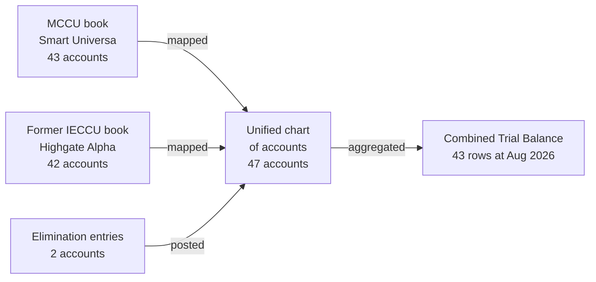
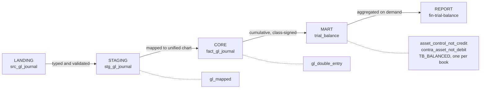

The Combined Trial Balance shows every general ledger account at a chosen close, on one chart of accounts, across both legacy books.

It is the anchor of the financial close. The statement of financial position, the statement of comprehensive income, the DCFS prudential returns and budget variance are all built from the same warehouse rows this report reads, so a statement caption always traces back to the GL codes beneath it.

| | |
|---|---|
| Report key | `fin-trial-balance` |
| Edition | Comply, tier 1 |
| Owner | Finance Officer |
| Capability | `reports.financial.run` |
| Source | `edw_mart.trial_balance` |
| Frequency | Monthly, on demand |
| Drill-down | Composition, Trend, Movement |

## What it answers

What is the balance of every general ledger account at this close, and what moved through it during the period?

It answers what happened. It does not explain why, estimate anything or recommend anything, which is why it sits at Comply and is available to every institution on the platform.

## Why it is called Combined

The institution runs two legacy books. The MCCU book is kept in Smart Universa. The former IECCU book, carried over from the merger, is kept in Highgate Alpha. The two systems use different account codes for the same things.

ARGOS maps both onto a single unified chart of accounts as the journals load, so an account means the same thing whichever system it came from.

Combining is an aggregation, not a reconciliation. The **Book** parameter selects one source or all three.

<Note>
  **Eliminations are entries, not adjustments.** Inter-book balances are removed by posting a third set of journals to an `ELIMINATION` book, not by subtracting a number somewhere. At the August 2026 close that is a single pair: `1500 Prepayments and Other Assets` and `2200 Accounts Payable and Accruals`, each carrying `-18,717,893.77`. The pair is itself balanced, which is why combining the three books cannot unbalance the result.
</Note>

## The three parameters

| Parameter | Default | What it changes |
|---|---|---|
| **Period** | Last close | The month the balances are struck at. Balances are cumulative, so choosing July shows the position at the July close, not July's activity on its own. |
| **Book** | Combined entity | Combined entity includes MCCU, former IECCU and the elimination entries. The two single-book options show one source as the legacy core reports it, which is what you want when reconciling against that system. |
| **Hide nil balances** | Yes | Suppresses accounts with no balance and no movement. Turn it off to see the complete chart, which is how you prove an account genuinely has nothing in it. |

<Frame caption="The line under the parameters records who owns the report, the modules it satisfies, the capability it required, the row count, the time taken, and the run identifier that keys its entry in the audit trail.">
  
</Frame>

## Reading a row

Seven columns. Every one is defined in the warehouse rather than computed in the interface.

<Frame caption="The small chevron beside a GL code marks an account that opens into its detail.">
  
</Frame>

| Column | Meaning |
|---|---|
| `gl_code` | The account's code on the unified chart, not the legacy code from either core system |
| `gl_name` | The account name. This is the column that opens into a breakdown |
| `account_class` | asset, liability, equity, income or expense. The class decides the sign |
| `opening_balance` | The position carried into the period, including everything before the reporting window |
| `period_debits` | Total debits posted in the period. Always positive or nil |
| `period_credits` | Total credits posted in the period. Always positive or nil |
| `closing_balance` | The position at the close, presented on the sign of the account class |

<Note>
  **The opening balance is not the first journal of the period.** Balances carry forward. The opening balance includes every journal posted before the reporting window, brought forward as a single position, so the earliest month in the warehouse does not start from zero and misstate itself.
</Note>

## The sign convention

A classical trial balance has two money columns, debit and credit, and every account sits in one of them. This report has one closing column, and the **account class** decides the sign, not the account's own normal balance.

The rule is short. **Assets and expenses are positive when they are debit balances. Liabilities, equity and income are positive when they are credit balances.** Read that way, a positive number always means more of what the class is, and a class total needs no special case.

| Class | Closing balance is |
|---|---|
| asset, expense | Opening **plus** debits **minus** credits |
| liability, equity, income | Opening **minus** debits **plus** credits |

Both forms, checked against the figures in the screenshot above:

- **Cash on Hand**, an asset: `12,639,826.22 + 55,056,492.95 - 54,444,097.20 = 13,252,221.97`
- **Members' Savings Deposits**, a liability: `137,402,997.15 - 88,272,996.16 + 90,095,438.52 = 139,225,439.51`

### Contra accounts close negative, by design

Two accounts in the asset class close negative, and both are supposed to.

<Frame caption="Property, plant and equipment of 27,058,184.69 less accumulated depreciation of 11,128,817.77 is the 15,929,366.92 that appears as Fixed assets on the statement of financial position.">
  
</Frame>

<Warning>
  Before querying a negative balance, check the account class and what the account is for. A contra account exists in order to be subtracted. Two data quality rules run on every load to police exactly this boundary: one asserts that ordinary asset control accounts never close in credit, the other that contra assets never close in debit.
</Warning>

## Two checks you can make on the face of the report

### Debits equal credits

The footer totals the columns. Debits and credits must be identical to the cent.

<Frame caption="The footer at the August 2026 close. Debits and credits agree exactly at 285,325,767.37.">
  
</Frame>

### The accounting identity holds

Group the closing balances by class and the balance sheet equation falls out. Income and expense have not been closed to equity at a monthly close, so they appear on the right.

| | Amount |
|---|---|
| Liabilities | 249,497,575.20 |
| Equity | 110,885,722.52 |
| Income | 22,578,036.41 |
| Expense | (16,292,106.52) |
| **Equals assets** | **366,669,227.61** |

The asset class in the same report closes at exactly `366,669,227.61`. Nothing in the interface asserts that identity. It emerges because the underlying journals balance.

<Note>
  **The footer's Opening and Closing totals are control figures, not positions.** They add balances across all five classes under the class-sign convention, so `765,922,668.26` is not total assets and is not meant to be read as money. Use it to compare one run against another. For a position, read the statement of financial position, which is built from these same rows.
</Note>

## Opening an account

Any account name carrying a chevron opens into its detail. Branch by default, and you can regroup by book, account class, statement line, DCFS line or period. The measure is yours to choose too: closing balance by default, but also opening balance, debits, credits or budget.

Cash on hand by branch in debits is a different question from cash on hand by branch in closing balance, and a cash officer asks both.

<Frame caption="Cash on Hand opened by branch. Opening a component narrows again: one branch, broken down by book or by period.">
  
</Frame>

## Where the numbers come from

Five stages, each recorded in the warehouse's own lineage register, with a control standing at each boundary.

The mart is not a copy of the journals. For every account, book and branch it builds a complete month grid, carries forward everything posted before the reporting window as a single opening position, accumulates the signed movement across months, then presents the result on the sign of the account class. The grid matters: an account with no activity in a month still has a balance, and a report that showed no row for it would mislead rather than shorten.

## The controls behind the figure

### Reconciliation

Three controls reconcile the ledger, one per book. Each compares what the source system reports against what the warehouse computed, at zero tolerance. Not a percentage, not a rounding allowance.

| Control | Source | Warehouse | Variance | Status |
|---|---|---|---|---|
| `TB_BALANCED_MCCU` | 255,308,618.36 | 255,308,618.36 | 0.00 | reconciled |
| `TB_BALANCED_IECCU` | 26,733,343.00 | 26,733,343.00 | 0.00 | reconciled |
| `TB_BALANCED_ELIMINATION` | 3,283,806.01 | 3,283,806.01 | 0.00 | reconciled |

### Data quality

Four rules bear on this report. All four are critical, all four are owned by the Data Steward, and each runs on every load.

| Rule | Asserts | Checked | Failed |
|---|---|---|---|
| `gl_mapped` | Every journal line maps to the unified chart | 13,888 | 0 |
| `gl_double_entry` | The general ledger balances every day | 376 | 0 |
| `asset_control_not_credit` | Asset control accounts never close in credit | 78 | 0 |
| `contra_asset_not_debit` | Contra asset accounts never close in debit | 12 | 0 |

<Note>
  **Why "balances every day" and not "balances at the close".** A ledger that balances monthly can still contain a day on which it did not. The rule is evaluated per business date, so an intra-period defect is caught on the day it happened rather than netted away by the close.
</Note>

## Who can run it

Running this report requires `reports.financial.run`. Four roles hold it: Administrator, Finance Officer, Risk Analyst and Report Developer.

Every run writes to the audit trail before it returns: who ran it, the parameters, what triggered it, the row count, the duration and whether it succeeded. Exports carry the same record, so "who has this figure left the building with" is a question the warehouse can answer.

## Questions people ask

<AccordionGroup>
  <Accordion title="Why doesn't this tie to what Smart Universa prints?">
    Check the **Book** parameter first. The default is Combined entity, which includes the former IECCU book and the elimination entries, so it will not match a single core system. Set Book to the MCCU book to compare like with like.

    If it still does not tie, the three reconciliation controls above compare exactly these two figures and record the variance.
  </Accordion>
  <Accordion title="Why is an asset showing a negative balance?">
    Almost always because it is a contra account: accumulated depreciation, or the expected credit loss allowance. Under the class-sign convention a contra asset is negative by design, and a data quality rule asserts that it must be.
  </Accordion>
  <Accordion title="The Opening and Closing totals in the footer look wrong.">
    They are control totals, not positions. The footer adds balances across all five account classes, so the figure is not total assets and is not meant to be read as money. Use it to compare one run against another, and use the statement of financial position for a position.
  </Accordion>
  <Accordion title="Only 43 accounts came back. The chart has 47.">
    **Hide nil balances** is on by default. Turn it off to see every account on the chart, including those with no balance and no movement in the period.
  </Accordion>
  <Accordion title="Can I get this at a date that is not a month end?">
    No. The trial balance is struck at monthly closes, which is the grain the warehouse is built at and the grain regulators ask for. Daily positions are available through liquidity and balance reporting instead.
  </Accordion>
  <Accordion title="Someone changed a report definition. How would we know?">
    Report definitions are governed rows in the warehouse, not code in the interface, and the definition behind any run is displayed from the report header. What a user may run, and the capability it required, is a matter of record rather than of configuration.
  </Accordion>
</AccordionGroup>

## What this replaces

Most credit unions produce a combined trial balance by exporting from each core system, pasting both into a workbook, mapping the codes by hand or with a lookup somebody maintains, adding the elimination adjustments, and checking that it balances. It works, and it is reproducible only by the person who built it.

| The workbook | ARGOS |
|---|---|
| Code mapping lives in a lookup tab one person maintains | Mapping is applied at load and recorded in the lineage register |
| Eliminations are typed adjustments | Eliminations are posted journals in their own book, themselves balanced |
| "It balances" is checked by the person building it | Three reconciliations and four critical data quality rules run on every load, at zero tolerance |
| A figure is traced by asking whoever built the file | A figure opens into its own detail, by branch, book, class or period |
| Who took a copy is unknowable | Every run and every export is recorded against a named user |
| Last month's file is last month's logic | One governed definition produces every period the same way |

The difference is not speed. At a DCFS examination, every figure on this report can be walked back to the journal line that produced it, through controls that were evaluated at the time rather than reconstructed afterwards.

<Note>
  Figures on this page come from the demonstration warehouse of Meridian Co-operative Credit Union at the August 2026 close. Meridian is not a real credit union.
</Note>
