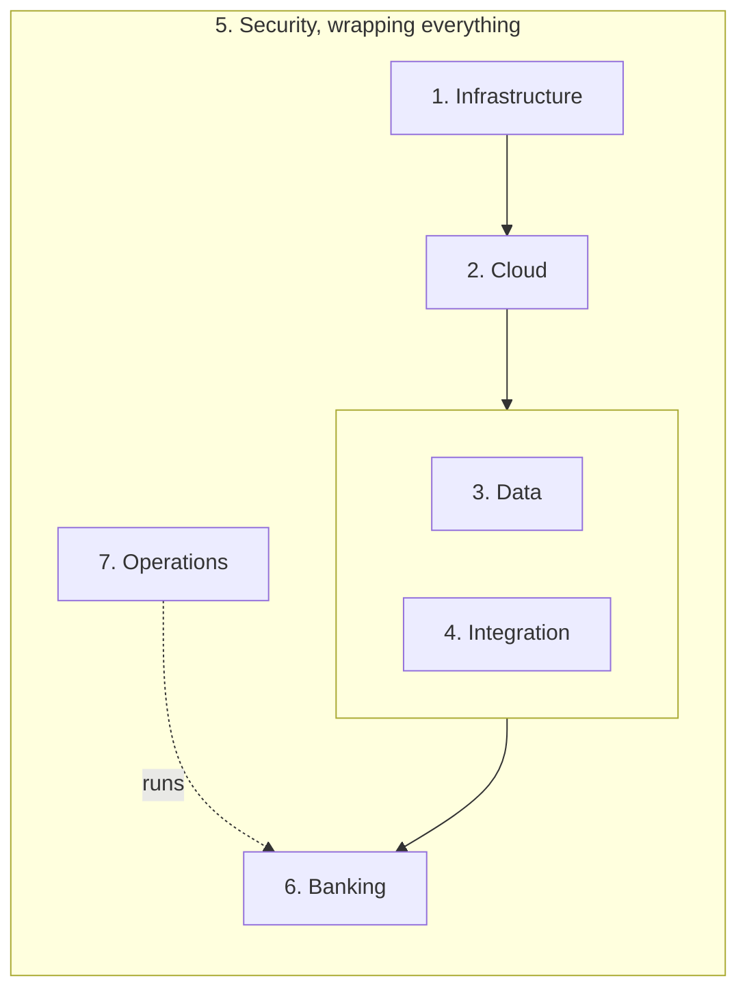

Every ATLAS engagement starts from the same seven-platform reference architecture and tailors it. Each platform has a defined technology stack and a defined business outcome.

The platforms stack deliberately. Infrastructure carries the cloud runtime. The cloud runtime carries the data platform. Data and integration carry the banking platform. Security and operations wrap all of it.

## The seven platforms

| # | Platform | Business outcome | Delivered by |
|---|---|---|---|
| 1 | Enterprise Infrastructure | Reliable, resilient, scalable infrastructure | KAIROS |
| 2 | Cloud | A cloud-native platform for secure application delivery | KAIROS |
| 3 | Enterprise Data | High availability and zero-data-loss data services | KAIROS and ARGOS |
| 4 | Enterprise Integration | Integration across all systems and channels | OMNIA |
| 5 | Enterprise Security | Cyber resilience and a Zero Trust posture | Cross-cutting |
| 6 | Enterprise Banking | Modern banking capability that drives member value | OMNIA |
| 7 | Enterprise Operations | Continuous operations and business continuity | APTOS |

Security is deliberately not a layer in the stack. Platform 5 supplies the technology, but the model applies to every layer, every site and every service.

## Security surrounds everything

Five cross-cutting disciplines, applied to all seven platforms:

<CardGroup cols={2}>
  <Card title="Identity and access" icon="key">
    Least-privilege, auditable access to every platform, console and API.
  </Card>
  <Card title="Threat protection" icon="shield">
    Next-generation firewalling, segmentation, and a Zero Trust posture between all zones and workloads.
  </Card>
  <Card title="Security monitoring" icon="eye">
    SOC coverage around the clock, with continuous detection and response.
  </Card>
  <Card title="Compliance and governance" icon="scale">
    Audit-ready controls aligned to banking regulation and examiner expectations.
  </Card>
</CardGroup>

<Card title="Data protection" icon="lock">
  Encryption, snapshots and zero-data-loss replication for the institution's most critical asset.
</Card>

For a regulated institution this is more than a security stance. The architecture itself documents the control environment, which is an examination asset.

## What zero data loss means

The Recovery Point Objective measures how much committed data an institution can lose in a disaster. Most architectures accept minutes or hours. The data platform is engineered for RPO of zero: a transaction is acknowledged to the application only once it has been durably written at both sites of the synchronous pair.

Four mechanisms make that claim credible rather than aspirational.

<Steps>
  <Step title="Synchronous database commit across sites">
    The write is not acknowledged until both sites hold it.
  </Step>
  <Step title="A three-instance cluster inside each site">
    The database itself has no single point of failure, before replication is considered.
  </Step>
  <Step title="An extended SAN fabric between sites">
    Storage traffic runs between sites at 32Gb/s over the Cisco MDS fabric using FCIP.
  </Step>
  <Step title="Rehearsed failover">
    Application-consistent snapshots and a tested procedure, so recovery is something that has been done before rather than something hoped for.
  </Step>
</Steps>

<Note>
  RPO of zero applies to the synchronous metro pair. See [the data centre footprint](/kairos/data-centres) for which sites are synchronous and which replicate asynchronously.
</Note>
