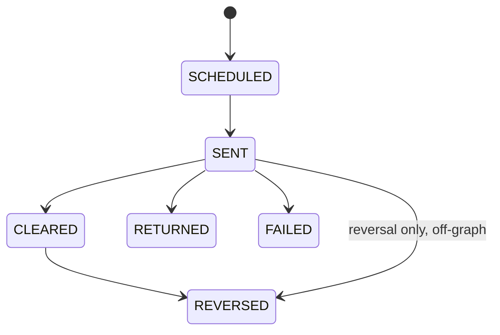

A released disbursement moves through settlement states as the payment travels on the rail, and every move writes an immutable lifecycle event. A reversal claws a payment back and always requires a reason.

## The settlement states

The `DisbursementSettlementStatus` enum holds six values.

| Status | Meaning |
| --- | --- |
| `SCHEDULED` | Created, not yet released. |
| `SENT` | Released to the rail. The cheque is issued or the ACH/RTGS leg is sent. |
| `CLEARED` | Settled at the destination. |
| `RETURNED` | Bounced back, for example a bad or closed account. |
| `FAILED` | The rail rejected the instruction. |
| `REVERSED` | Clawed back after release. |

A new instruction starts at `SCHEDULED`. Executing the disbursement moves it to `SENT`. From there it reaches `CLEARED`, or `RETURNED`, or `FAILED`. A `SENT` or `CLEARED` payment can be `REVERSED`.

Each transition is validated. An attempt to move between states the graph does not allow is refused with an `INVALID_SETTLEMENT_TRANSITION` error.

## Advancing the settlement

`advanceSettlement` moves the status forward, validates the move, stamps the matching timestamp where one exists, and writes an immutable `DisbursementLifecycleEvent`. It is used for `SENT`, `CLEARED`, `RETURNED`, and `FAILED`. `SENT`, `CLEARED`, and `RETURNED` each stamp their own timestamp column (`sentAt`, `clearedAt`, `returnedAt`); `FAILED` has no timestamp column, so a move to `FAILED` records the lifecycle event and status only.

Advancing settlement is gated by the `disbursements.settlement.update` capability, which the **Disbursement** role holds.

The audit events are exact:

| Move | Event |
| --- | --- |
| To `SENT` | `disbursement.settlement.sent` |
| To `CLEARED` | `disbursement.settlement.cleared` |
| To `RETURNED` | `disbursement.settlement.returned` |
| To `FAILED` | `disbursement.settlement.failed` |

A move to `RETURNED` records its reason on the instruction's `returnReason` field and on the lifecycle event.

## Reversing a disbursement

`reverseDisbursement` claws back a released payment. It is valid only from `SENT` or `CLEARED`, and it **requires** a reason. The reversal stamps a `reversedAt` timestamp and writes the reason to the instruction's `reversalReason` field, not `returnReason`. The reason is also recorded on the lifecycle event and in the audit log.

Reversal is gated by the `disbursements.reverse` capability, which the **Disbursement** role holds. The event is `disbursement.reversed`.

<Note>
A reversal with no reason is refused. The reason is mandatory because a claw-back of released funds is a high-stakes action that the audit trail must explain.
</Note>

A reversal does not go through the generic settlement transition graph. The graph models `CLEARED` to `REVERSED`, while `reverseDisbursement` runs its own from-status check that accepts both `SENT` and `CLEARED`.

## Not yet available

The following are planned but not yet built. They are part of a deferred Phase 5 and are not live today.

- Partial and tranche disbursement (multiple draws against one loan).
- Batch ACH and RTGS ISO 20022 file generation.
- Return-file reconciliation.
- Receipt and payment-advice PDFs.
- Multi-currency and FX.
