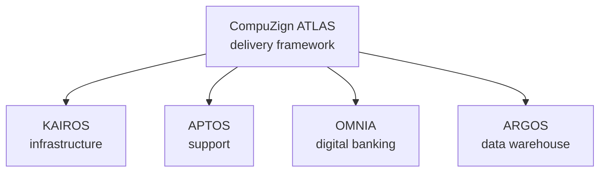

CompuZign builds and runs the technology a financial institution depends on. One framework governs how it is delivered. Four platforms are what gets delivered.

ATLAS is not something you buy. It is the discipline through which the four platforms are designed, built, automated and operated, and it is why they arrive as one environment rather than as four procurement exercises.

<CardGroup cols={2}>
  <Card title="ATLAS" icon="compass" href="/atlas/overview">
    Architecture, Technology, Lifecycle, Automation, Services. The delivery framework and the reference architecture it starts from.
  </Card>
  <Card title="KAIROS" icon="server" href="/kairos/overview">
    Infrastructure as a service. Compute, all-flash storage, SAN fabric and the cloud-native runtime across three data centres.
  </Card>
  <Card title="APTOS" icon="life-buoy" href="/aptos/overview">
    Support as a service. Managed services, cybersecurity, the Global Support Centre of Excellence, NOC and SOC.
  </Card>
  <Card title="OMNIA" icon="banknote" href="/omnia/overview">
    Digital banking. Core banking with Profile Software Finuevo, loan origination, onboarding and member channels.
  </Card>
  <Card title="ARGOS" icon="database" href="/argos/overview">
    The enterprise data warehouse. Sixty-six governed reports for credit unions, reconciled to the general ledger before anyone sees them.
  </Card>
  <Card title="Loan Origination System" icon="file-text" href="/omnia/los/introduction">
    The most complete documentation set on this site. Capture, adjudicate, secure, disburse and file loans in one audited workflow.
  </Card>
</CardGroup>
