Every loan application moves through a defined workflow. Each status tells you where the application is, who is responsible for it, and what happens next. The initial state is DRAFT, and a loan comes to rest in one of four terminal states: FILED, DECLINED, DRAFT_ABANDONED, or CANCELLED.

## All workflow states

| State | Who is responsible | Description |
|---|---|---|
| **DRAFT** | Credit Officer | The application is being filled in. The officer can save progress and return at any time. A draft does not appear in any review queue, and only the originating Credit Officer works on it. |
| **SUBMITTED** | Adjudicator | The officer submitted the application. The risk assessment is computed during the submit step, and the application is queued for adjudication right away. The status changes to ADJUDICATION when an Adjudicator claims the file. |
| **ADJUDICATION** | Adjudicator | The Adjudicator reviews the application, the risk score, and supporting information, then makes a decision: Approve, Decline, or Request Information. |
| **INFO_REQUESTED** | Credit Officer | The Adjudicator needs more information before deciding. The application rests here, owned by the officer, until the officer sends it back to DRAFT to make the required updates and resubmit. The risk assessment is recalculated on resubmission. |
| **APPROVED** | System | The Adjudicator approved the application. The loan always moves to **SECURITIES** next. Secured loans (Auto, Mortgage, Cash-Secured) wait there for collateral review. Unsecured loans have no collateral, so they are auto-skipped through Securities and routed straight to Disbursement in the same step. |
| **SECURITIES** | Securities | The Securities team verifies and perfects the collateral, then clears it for disbursement. The documents requested are set per loan rather than fixed by the system. |
| **SECURITIES_ISSUE** | Adjudicator | The Securities team flagged a structural problem with the collateral package (for example, a valuation mismatch or ineligible collateral) and sent it back to the Adjudicator. The Adjudicator resolves the issue and returns the file to the Securities team. |
| **DISBURSEMENT** | Disbursement | All collateral has been cleared. Disbursement schedules the payees and executes the release of funds. |
| **DISBURSED** | Disbursement | Funds have been released. The Disbursement team files the loan to complete it. If the `securitiesFinalCheckRequired` tenant workflow override is set (it defaults to off), the loan returns to Securities for a final post-disbursement check first. |
| **FILED** | Terminal | The loan record is locked. The audit trail is complete. No further edits or transitions are possible. |
| **DECLINED** | Terminal | The Adjudicator declined the application. The record is sealed and preserved in the audit trail. |
| **DRAFT_ABANDONED** | Terminal | The Credit Officer chose not to proceed with the draft and selected Abandon Draft. |
| **CANCELLED** | Terminal | The application was cancelled. Cancellation is possible from SUBMITTED (before adjudication begins) and from DISBURSEMENT (the late-stage escape hatch). A disbursement that has already been executed blocks cancellation. |

<Tip>
  If you are not sure what to do next on a loan, check the status badge. It tells you which department holds the ball.
</Tip>

---

## How states connect

The diagram below shows the primary path a loan takes from creation to filing, plus the send-back, revert, and cancel branches. Several states can send a file backward: an Adjudicator can return it to DRAFT for a full rebuild, Securities can return it to DRAFT or back one stage to ADJUDICATION, and Disbursement can revert it to SECURITIES.

```mermaid
stateDiagram-v2
    [*] --> DRAFT
    DRAFT --> SUBMITTED: submit
    DRAFT --> DRAFT_ABANDONED: abandon
    SUBMITTED --> ADJUDICATION: adjudicator claims
    SUBMITTED --> CANCELLED: cancel
    ADJUDICATION --> APPROVED: approve
    ADJUDICATION --> DECLINED: decline
    ADJUDICATION --> INFO_REQUESTED: request info
    ADJUDICATION --> DRAFT: send back for rebuild
    INFO_REQUESTED --> DRAFT: officer updates
    APPROVED --> SECURITIES: approved
    SECURITIES --> SECURITIES_ISSUE: issue flagged
    SECURITIES_ISSUE --> SECURITIES: adjudicator resolves
    SECURITIES --> DISBURSEMENT: all requests resolved; auto for unsecured
    SECURITIES --> DRAFT: send back for rebuild
    SECURITIES --> ADJUDICATION: revert one stage
    DISBURSEMENT --> DISBURSED: funds released
    DISBURSEMENT --> SECURITIES: revert
    DISBURSEMENT --> CANCELLED: late-stage cancel
    DISBURSED --> SECURITIES: optional final check
    DISBURSED --> FILED: archive
    FILED --> [*]
    DECLINED --> [*]
    DRAFT_ABANDONED --> [*]
    CANCELLED --> [*]
```

While a loan sits in DISBURSEMENT, the status badge shows one of two sub-state labels: **AWAITING SCHEDULE** before a disbursement instruction exists, and **AWAITING EXECUTION** once the instruction is scheduled.

---

## Section locking

Once a loan application moves past DRAFT status, all form sections become **read-only**. You can no longer edit the applicant information, employment details, statement of affairs, or collateral data while the loan is under review.

The only exceptions are states where the platform explicitly unlocks specific sections for a targeted action.

- **INFO_REQUESTED:** the application returns to DRAFT, so the officer can update the sections the Adjudicator identified as needing clarification, then resubmit.
- **SECURITIES_ISSUE:** this state is owned by the Adjudicator, who resolves the flagged structural problem and returns the file to Securities. Routine document collection happens through the security-request loop while the loan is in SECURITIES, not in SECURITIES_ISSUE.

All other sections stay locked throughout the loan's lifetime after submission. This protects the integrity of the record the Adjudicator reviewed and ensures the audit trail reflects what was actually decided.

---

## Status badge colours

The platform displays a coloured status badge on every loan record in the loans list view. The colours give a quick visual cue.

| Colour | States |
|---|---|
| **Grey** | DRAFT |
| **Blue** | SUBMITTED, ADJUDICATION, SECURITIES, DISBURSEMENT |
| **Amber** | INFO_REQUESTED, SECURITIES_ISSUE |
| **Green** | APPROVED, DISBURSED, FILED |
| **Red** | DECLINED |
| **Purple** | DRAFT_ABANDONED, CANCELLED |

<Note>
  This table describes the list view. The badge on the application header uses a slightly different palette: it groups DRAFT_ABANDONED and CANCELLED with DRAFT and shows all three as grey rather than purple.
</Note>

<Note>
  Loans are never deleted. Even DECLINED or CANCELLED applications stay in the system for the audit record. Staff with the appropriate read permissions can always locate and review the full history of any application.
</Note>
